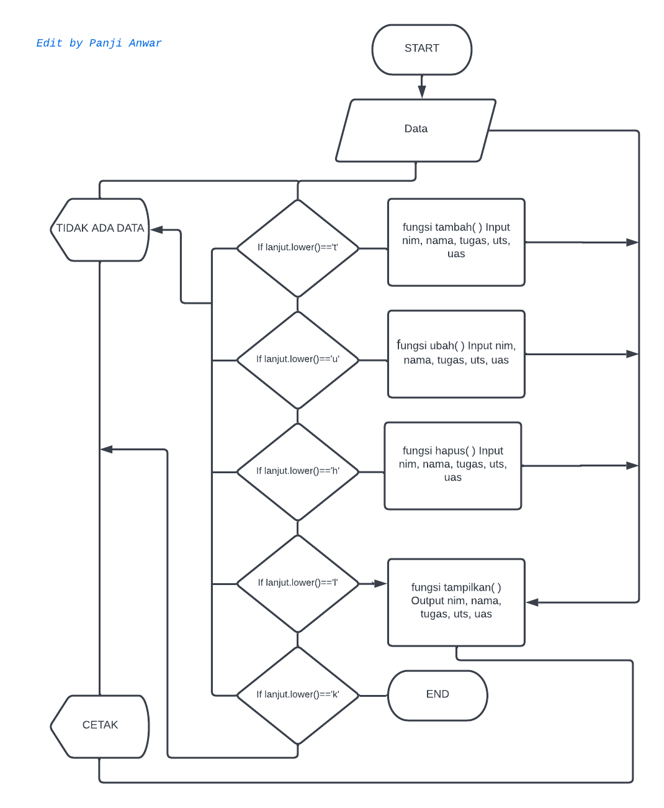
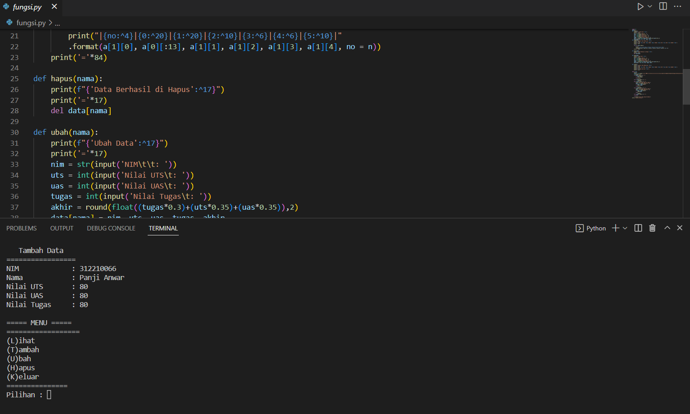
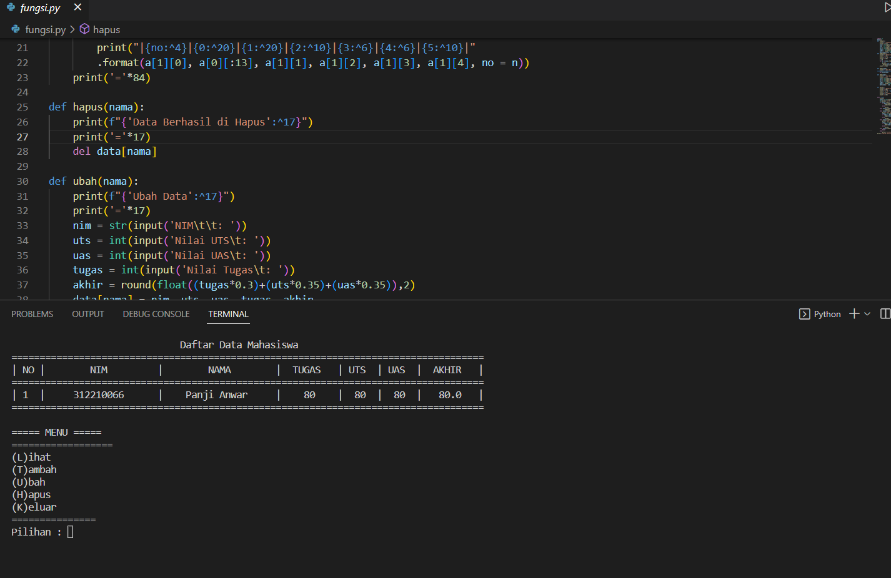
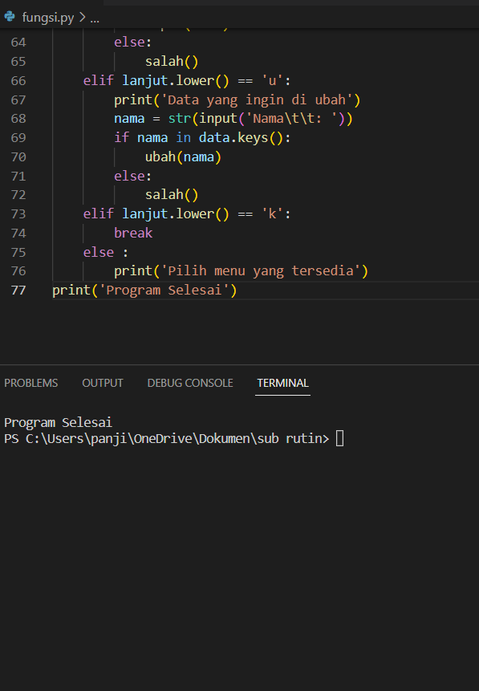

# praktikum6.py
```bash
Nama        :Panji Anwar Sanusi

NIM         :312210066

Kelas       :TI.22.C1
```

## PROGRAM INPUT NILAI MAHASISWA MENGGUNAKAN SYNTAX FUNGSI

### FLOWCHART PROGRAM


### PENJELASAN PROGRAM
Fungsi atau dalam istilah pemrograman disebut dengan “function” merupakan blok kode yang digunakan untuk menyelesaikan masalah spesifik

Fungsi secara singkat yakni meringkas sebuah program yang berulang-ulang dengan menggunakan syntaks def nama_fungsi(argument). def diartikan sebagai definisi.

- Kita akan mendeklarasikan atau menginput sebuah variabel bertipe data dictionary kosong data={} yang nantinya akan kita inputkan sebuah data yang terdiri dari: nama, nim, nilai_tugas, nilai_uts, nilai_uas dan nilai_akhir.
- Membuat fungsi
1. Fungsi tambah(), untuk menambahkan data def tambah()
2. Fungsi tampilkan(), untuk menampilkan data def tampilkan()
3. Fungsi hapus(nama), untuk menghapus nama pada data def hapus(nama)
4. Fungsi ubah(nama), untuk mengubah nama pada data def ubah(nama)
5. Fungsi salah(), untuk inputan yang tidak sesuai perintah def salah()
- Menggunakan Perulangan while (while loop) while True:, dapat diartikan perulangan akan terus mengulang jika inputan benar dan masuk kedalam proses jika tidak maka perulangan berhenti atau lanjut ke proses selanjutnya. variabel lanjut kita gunakan untuk menginput perintah yang akan kita proses lanjut=input(str('(L)ihat, (T)ambah, (U)bah, (H)apus, (K)eluar)), disini kita menggunakan statement if untuk memproses perintah yang di inginkan sesuai inputan pada variabel lanjut:
```bash
if lanjut.lower() == 'l':

if data.items():

`tampilkan()`
else:

`salah()`
if lanjut.lower() == 't':

tambah()

if lanjut.lower() == 'h':

nama = input(str('Nama\t: '))

if nama in data.items():

`hapus(nama)`
else:

`salah()`
if lanjut.lower == 'u':

nama = input(str('Nama\t: '))

if nama in data.items():

`ubah(nama)`
else:

`salah()`
```
### CODE PROGRAM

```bash
import os
data={}
def tambah():
    print(f"{'Tambah Data':^17}")
    print('='*17)
    nim = str(input('NIM\t\t: '))
    nama = str(input('Nama\t\t: '))
    uts = int(input('Nilai UTS\t: '))
    uas = int(input('Nilai UAS\t: '))
    tugas = int(input('Nilai Tugas\t: '))
    akhir = round(float((tugas*0.3)+(uts*0.35)+(uas*0.35)),2)
    data[nama]=nim, uts, uas, tugas, akhir
def tampilkan():
    print(f"{'Daftar Data Mahasiswa':^82}")
    print('='*84)
    print(f"|{'NO':^4}|{'NIM':^20}|{'NAMA':^20}|{'TUGAS':^10}|{'UTS':^6}|{'UAS':^6}|{'AKHIR':^10}|")
    print('='*84)
    n = 0
    for a in data.items():
        n += 1
        print("|{no:^4}|{0:^20}|{1:^20}|{2:^10}|{3:^6}|{4:^6}|{5:^10}|"
        .format(a[1][0], a[0][:13], a[1][1], a[1][2], a[1][3], a[1][4], no = n))
    print('='*84)

def hapus(nama):
    print(f"{'Data Berhasil di Hapus':^17}")
    print('='*17)
    del data[nama]

def ubah(nama):
    print(f"{'Ubah Data':^17}")
    print('='*17)
    nim = str(input('NIM\t\t: ')) 
    uts = int(input('Nilai UTS\t: '))
    uas = int(input('Nilai UAS\t: '))
    tugas = int(input('Nilai Tugas\t: '))
    akhir = round(float((tugas*0.3)+(uts*0.35)+(uas*0.35)),2)
    data[nama] = nim, uts, uas, tugas, akhir

def salah():
    print(f"{'Daftar Data Mahasiswa':^82}")
    print('='*84)
    print(f"|{'NO':^4}|{'NIM':^20}|{'NAMA':^20}|{'TUGAS':^10}|{'UTS':^6}|{'UAS':^6}|{'AKHIR':^10}|")
    print('='*84)
    print(F"|{'Tidak ada data':^82}|")
    print('='*84)
      
while True:
    print()
    lanjut = str(input('===== MENU =====\n==================\n(L)ihat\n(T)ambah\n(U)bah\n(H)apus\n(K)eluar\n===============\nPilihan : '))
    os.system("cls")
    if lanjut.lower() == 'l':
        if data.items():
            tampilkan()
        else:
            salah()
    elif lanjut.lower() == 't':
            tambah()
    elif lanjut.lower() == 'h':
        print('Data yang ingin di hapus')
        nama = str(input('Nama\t\t: '))
        if nama in data.keys():
            hapus(nama)
        else:
            salah()
    elif lanjut.lower() == 'u':
        print('Data yang ingin di ubah')
        nama = str(input('Nama\t\t: '))
        if nama in data.keys():
            ubah(nama)
        else:
            salah()
    elif lanjut.lower() == 'k':
        break
    else :
        print('Pilih menu yang tersedia')
print('Program Selesai') 
```
### BERIKUT HASIL PROGRAM
- Jika inputan lanjut=='t' berarti menmbahkan / (t)ambah, maka akan muncul untuk memasukkan nama, nim, nilai uts, uas dan tugas seperti dibawah ini :


- setelah menambahkan jika ingin melihat data yang sudah di tambahkan silahkan masukan 'l' untuk menmpilkan data dan hasilnya seperti dibawah ini :

- selanjutnya masukkan 'u' untuk mengubah data :
- jika ingin menghapus data silahkan masukkan 'h' untuk menghapus

- jika sudah selesai ingin mengakhirinya, masukkan 'k' untuk keluar :



Terimakasih